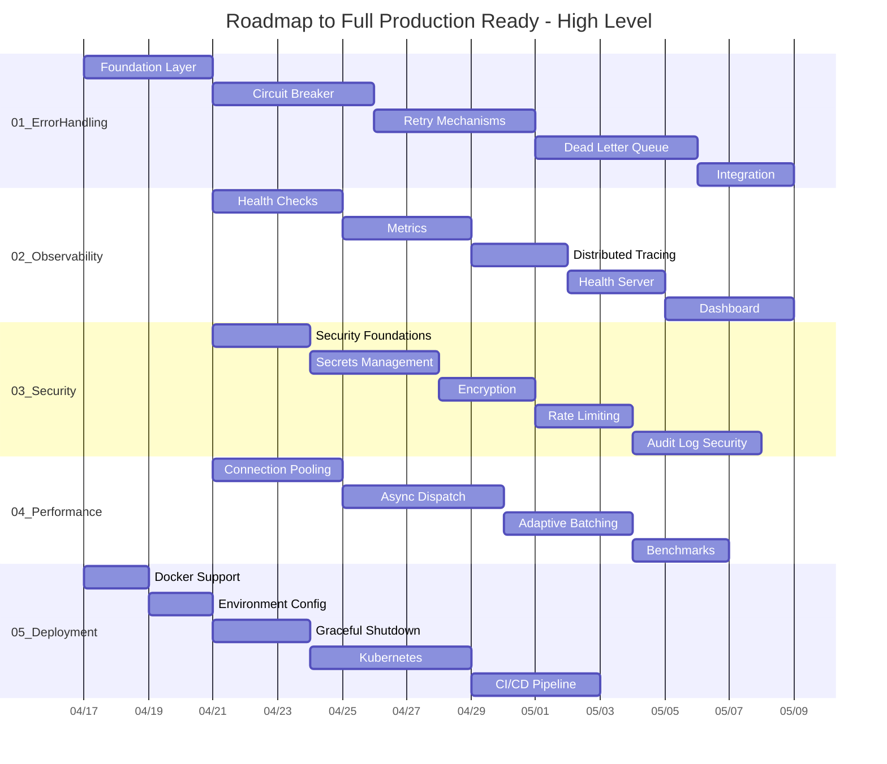
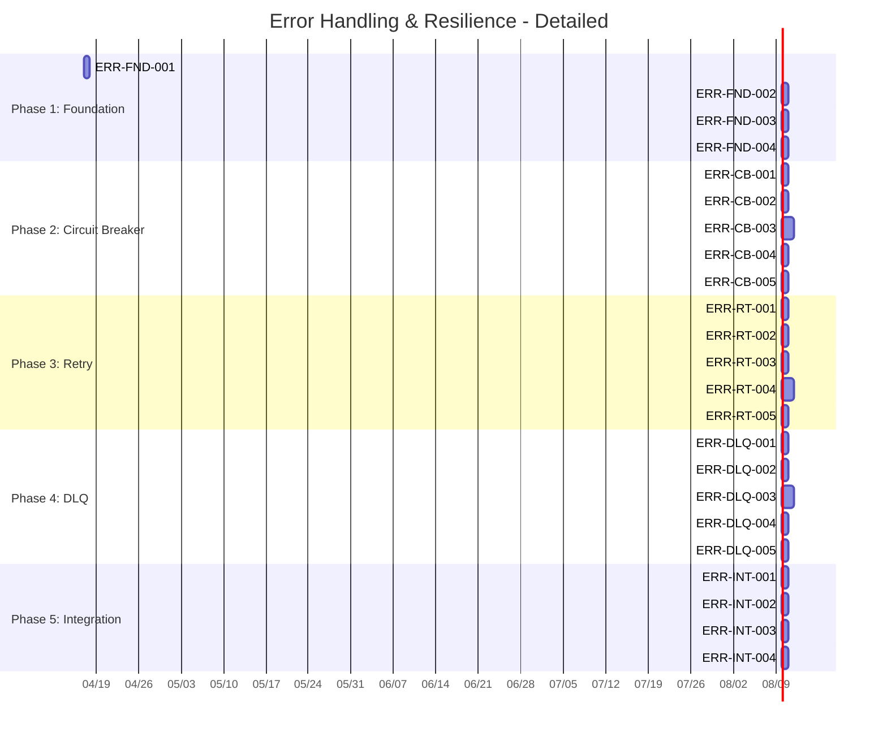
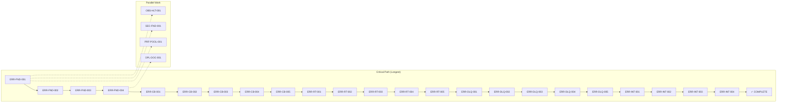

# Gantt Chart - Timeline Visualization

**Document Version:** 1.0  
**Created:** 2026-04-17  

---

## 1. High-Level Timeline (Mermaid)

### 1.1 Timeline Overview



---

## 2. Detailed Task Timeline

### 2.1 Error Handling (01) Detailed



---

## 3. Critical Path

### 3.1 Critical Path Visualization



---

## 4. Milestones

### 4.1 Key Milestones

```mermaid
gantt
    dateFormat  YYYY-MM-DD
    axisFormat  %m/%d

    section Milestones
    M1: Foundation Complete     :milestone, m1, 2026-04-21, 0d
    M2: Circuit Breaker Done   :milestone, m2, after m1, 0d
    M3: Retry Ready            :milestone, m3, after m2, 0d
    M4: DLQ Complete          :milestone, m4, after m3, 0d
    M5: Error Handling Done    :milestone, m5, after m4, 0d
    M6: Health Endpoints Ready :milestone, m6, 2026-05-05, 0d
    M7: Security Complete      :milestone, m7, 2026-05-15, 0d
    M8: Performance Optimized :milestone, m8, 2026-05-25, 0d
    M9: K8s Ready             :milestone, m9, 2026-06-01, 0d
    M10: CI/CD Deployed       :milestone, m10, 2026-06-10, 0d
```

---

## 5. Capacity Planning

### 5.1 Resource Utilization

| Week | Focus Area | Tasks | Hours |
|------|-----------|-------|-------|
| Week 1 | 01_ErrorHandling | 8 | 16 |
| Week 2 | 01_ErrorHandling | 8 | 16 |
| Week 3 | 02_Observability | 6 | 12 |
| Week 3 | 03_Security | 4 | 8 |
| Week 4 | 02_Observability | 6 | 12 |
| Week 4 | 03_Security | 4 | 8 |
| Week 5 | 02_Observability | 4 | 8 |
| Week 5 | 03_Security | 4 | 8 |
| Week 6 | 04_Performance | 8 | 16 |
| Week 7 | 04_Performance | 8 | 16 |
| Week 8 | 05_Deployment | 8 | 16 |
| Week 9 | 05_Deployment | 8 | 16 |

---

## 6. Document Control

| Version | Date | Author | Changes |
|---------|------|--------|---------|
| 1.0 | 2026-04-17 | AI Assistant | Initial creation |

---

*This document visualizes the timeline and milestones for the Roadmap to Full Production Ready.*
