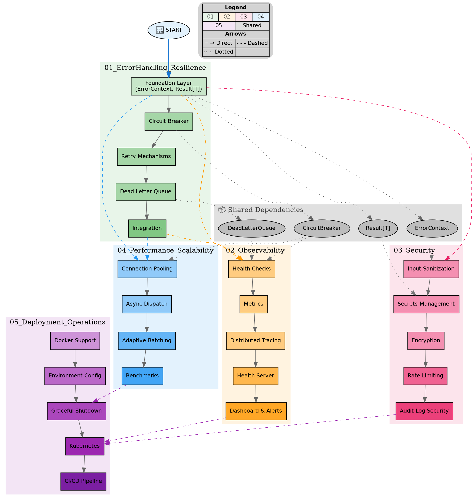
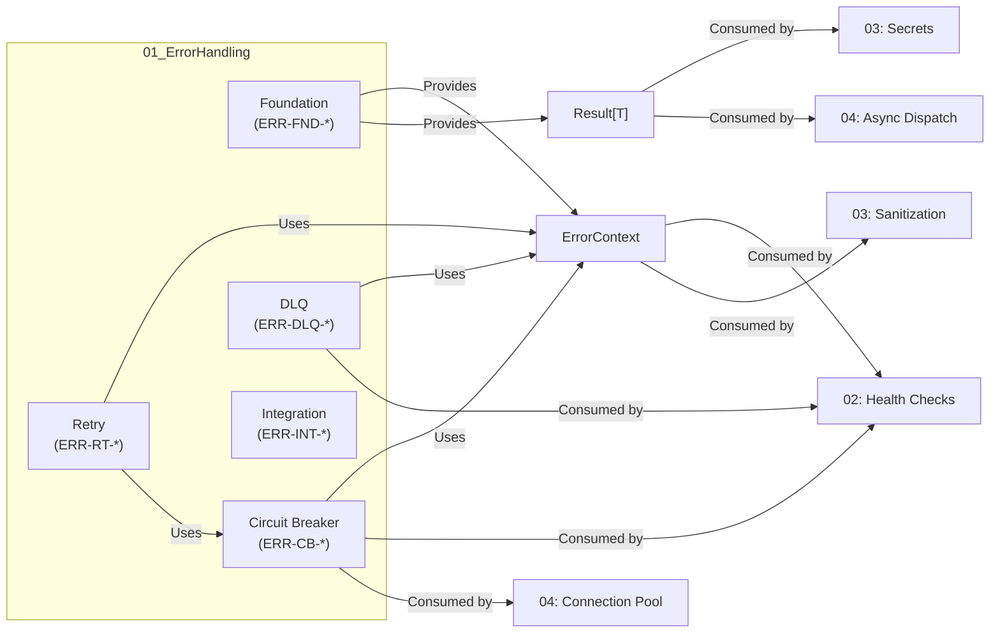
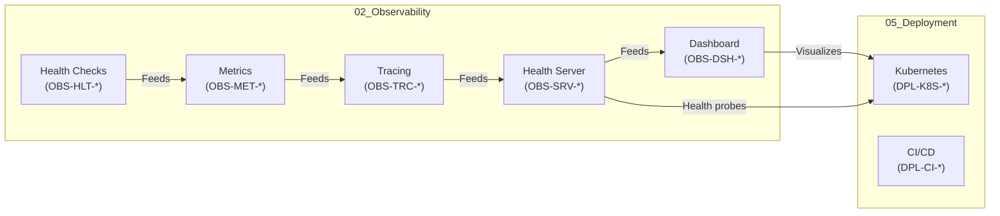
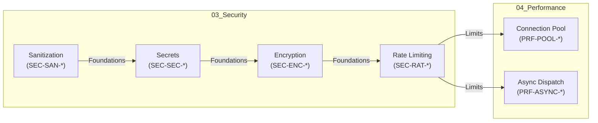
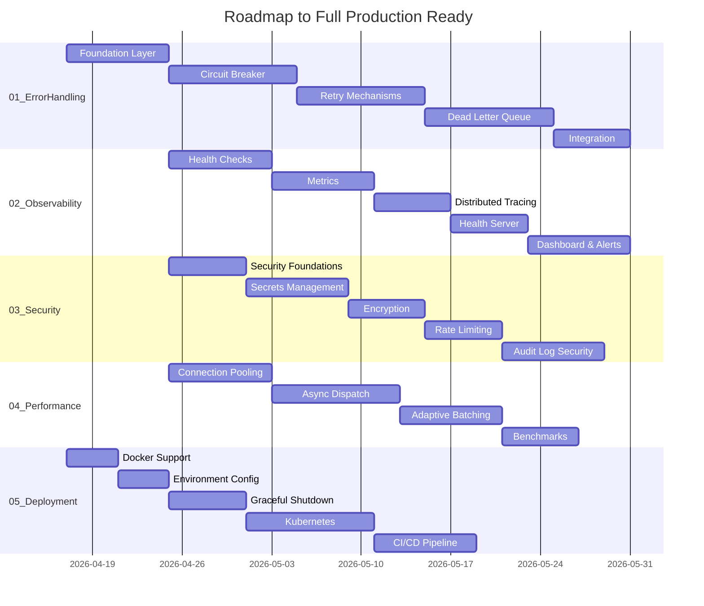

# Master Dependency Map
## Cross-Area Dependencies Visualization

**Document Version:** 1.0  
**Created:** 2026-04-17  

---

## 1. High-Level Dependency Graph

### 1.1 Mermaid Flowchart

```mermaid
flowchart TB
    subgraph START["🚀 START"]
        direction TB
        START_01[Start with Error Handling]
    end

    subgraph AREA_01["01_ErrorHandling_Resilience"]
        ERR_FND[Foundation Layer]
        ERR_CB[Circuit Breaker]
        ERR_RT[Retry Mechanisms]
        ERR_DLQ[Dead Letter Queue]
        ERR_INT[Integration]
    end

    subgraph AREA_02["02_Observability"]
        OBS_HLT[Health Checks]
        OBS_MET[Metrics]
        OBS_TRC[Distributed Tracing]
        OBS_SRV[Health Server]
        OBS_DSH[Dashboard]
    end

    subgraph AREA_03["03_Security"]
        SEC_SAN[Input Sanitization]
        SEC_SEC[Secrets Management]
        SEC_ENC[Encryption]
        SEC_RAT[Rate Limiting]
        SEC_AUD[Audit Log Security]
    end

    subgraph AREA_04["04_Performance_Scalability"]
        PRF_POOL[Connection Pooling]
        PRF_ASYNC[Async Dispatch]
        PRF_BATCH[Adaptive Batching]
        PRF_BENCH[Benchmarks]
    end

    subgraph AREA_05["05_Deployment_Operations"]
        DPL_DOC[Docker Support]
        DPL_ENV[Environment Config]
        DPL_SHT[Graceful Shutdown]
        DPL_K8S[Kubernetes]
        DPL_CI[CI/CD Pipeline]
    end

    START_01 --> ERR_FND

    ERR_FND --> ERR_CB
    ERR_CB --> ERR_RT
    ERR_RT --> ERR_DLQ
    ERR_DLQ --> ERR_INT

    ERR_FND --> OBS_HLT
    ERR_FND --> SEC_SAN
    ERR_FND --> PRF_POOL

    ERR_INT --> OBS_HLT
    ERR_INT --> SEC_SAN
    ERR_INT --> PRF_POOL

    OBS_HLT --> OBS_MET
    OBS_MET --> OBS_TRC
    OBS_TRC --> OBS_SRV
    OBS_SRV --> OBS_DSH

    SEC_SAN --> SEC_SEC
    SEC_SEC --> SEC_ENC
    SEC_ENC --> SEC_RAT
    SEC_RAT --> SEC_AUD

    PRF_POOL --> PRF_ASYNC
    PRF_ASYNC --> PRF_BATCH
    PRF_BATCH --> PRF_BENCH

    PRF_BENCH --> DPL_SHT
    OBS_DSH --> DPL_K8S
    SEC_AUD --> DPL_K8S

    DPL_DOC --> DPL_ENV
    DPL_ENV --> DPL_SHT
    DPL_SHT --> DPL_K8S
    DPL_K8S --> DPL_CI

    subgraph DEPEND["📦 Shared Dependencies"]
        DEP_CB[Circuit Breaker]
        DEP_DLQ[Dead Letter Queue]
        DEP_RESULT[Result[T] Type]
        DEP_ERROR[ErrorContext]
    end

    ERR_CB -.-> DEP_CB
    ERR_DLQ -.-> DEP_DLQ
    ERR_FND -.-> DEP_RESULT
    ERR_FND -.-> DEP_ERROR

    DEP_CB -.-> OBS_HLT
    DEP_CB -.-> PRF_POOL
    DEP_DLQ -.-> OBS_HLT
    DEP_RESULT -.-> SEC_SEC
    DEP_ERROR -.-> SEC_SAN
```

### 1.2 Graphviz DOT



---

## 2. Component Dependency Matrix

### 2.1 Who Provides What

| Component | Provided By | Used By |
|-----------|-------------|---------|
| `ErrorContext` | 01_FND-002 | 02_OBS, 03_SEC, 04_PRF |
| `Result[T]` | 01_FND-003 | 02_OBS, 03_SEC, 04_PRF, 05_DPL |
| `ResultOps` | 01_FND-004 | All areas |
| `CircuitBreaker` | 01_CB-003 | 02_OBS (health), 04_PRF (pool) |
| `CircuitBreakerRegistry` | 01_CB-004 | 02_OBS, 04_PRF |
| `RetryExecutor` | 01_RT-004 | 02_OBS, 04_PRF |
| `DeadLetterQueue` | 01_DLQ-003 | 02_OBS (health check) |
| `HealthEndpoint` | 02_HLT-004 | 05_DPL (probes) |
| `MetricRegistry` | 02_MET-001 | 05_DPL (monitoring) |
| `InputSanitizer` | 03_SAN-001 | All areas |
| `RateLimiter` | 03_RAT-001 | 04_PRF (dispatch) |
| `ConnectionPool` | 04_POOL-003 | 01_INT (dispatch) |

### 2.2 Dependency Matrix

```
          │ 01_ERR │ 02_OBS │ 03_SEC │ 04_PRF │ 05_DPL
─────────┼────────┼────────┼────────┼────────┼────────
01_ERR   │   -    │   D    │   D    │   D    │   -
02_OBS   │   -    │   -    │   -    │   -    │   D
03_SEC   │   -    │   -    │   -    │   D    │   -
04_PRF   │   D    │   -    │   -    │   -    │   D
05_DPL   │   -    │   -    │   -    │   -    │   -

Legend: D = Direct dependency
```

---

## 3. Phase Dependency Detail

### 3.1 Error Handling (01) → Others



### 3.2 Observability (02) → Deployment (05)



### 3.3 Security (03) → Performance (04)



---

## 4. Sequential Execution Order

### 4.1 Gantt-Style Timeline



---

## 5. Critical Path Analysis

### 5.1 Longest Path

```
Path Length: 5 areas + 1 gate = 6 phases

01_FND(4) → 01_CB(5) → 01_RT(5) → 01_DLQ(5) → 01_INT(4) → 02_HLT(5)
→ 02_MET(5) → 02_TRC(4) → 02_SRV(4) → 02_DSH(5) → 04_POOL(5) → 
04_ASYNC(5) → 04_BATCH(4) → 04_BENCH(4) → 05_SHT(5) → 05_K8S(5) → 05_CI(4)

Total: ~84 tasks
Estimated: 12-16 weeks
```

### 5.2 Shortest Path (Minimum Viable)

If we want minimum viable production:

```
01_FND(4) → 01_CB(5) → 01_RT(3) → 01_DLQ(3) → 01_INT(4) → 02_HLT(5) → 05_DOC(4) → 05_SHT(5) → 05_K8S(3)

Total: ~36 tasks
Estimated: 6-8 weeks
```

---

## 6. Risk Assessment by Area

### 6.1 Risk Matrix

| Area | Technical Risk | Integration Risk | Schedule Risk | Overall |
|------|----------------|------------------|---------------|---------|
| 01_ErrorHandling | LOW | LOW | LOW | **LOW** |
| 02_Observability | MEDIUM | MEDIUM | MEDIUM | **MEDIUM** |
| 03_Security | MEDIUM | HIGH | LOW | **HIGH** |
| 04_Performance | HIGH | HIGH | MEDIUM | **HIGH** |
| 05_Deployment | LOW | MEDIUM | MEDIUM | **MEDIUM** |

### 6.2 Risk Details

| Risk ID | Area | Risk | Likelihood | Impact | Mitigation |
|---------|------|------|------------|--------|------------|
| R-01 | 01 | Thread safety bugs | Medium | High | Extensive testing |
| R-02 | 02 | Performance overhead | Low | Medium | Benchmarking |
| R-03 | 03 | Security vulnerabilities | Medium | Critical | Security review |
| R-04 | 04 | Breaking existing dispatch | High | High | Minimal changes |
| R-05 | 05 | K8s compatibility | Low | Medium | Early testing |

---

## 7. Document Control

| Version | Date | Author | Changes |
|---------|------|--------|---------|
| 1.0 | 2026-04-17 | AI Assistant | Initial creation |

---

*This document visualizes cross-area dependencies for the Roadmap to Full Production Ready.*
