# Logging System Architecture Analysis

## Table of Contents

1. [Filesystem Structure](#1-filesystem-structure)
2. [Holistic System Overview](#holistic-system-overview)
3. [Layer 1: Models (PODs - Data Transfer Objects)](#layer-1-models-pods---data-transfer-objects)
4. [Layer 2: Ports (Interfaces/Contracts)](#layer-2-ports-interfacescontracts)
5. [Layer 3: Services (Stateful Business Logic)](#layer-3-services-stateful-business-logic)
6. [Layer 4: Adapters, Handlers, Resolvers & Composables](#layer-4-adapters-handlers-resolvers--composables)
7. [Component Interaction Diagrams](#component-interaction-diagrams)
8. [Data Flow Architecture](#data-flow-architecture)
9. [CLI (Command Line Interface)](#cli-command-line-interface)
10. [Specialization Module](#specialization-module)
11. [Resource Management](#resource-management)
12. [System Capabilities Summary](#system-capabilities-summary)

---

## 1. Filesystem Structure

```
03.0020_LoggingSystem/
├── README.md
│
├── 00_Project_Management/
│   └── [Project Management Files]
│
├── 01_Architecture/
│   ├── 00_LoggingSystem_ArchitectureDigitalTwin_FileSystem.md
│   └── ArcAnalysis/
│       ├── LoggingSystem_Architecture_Analysis.md       ← (this document)
│       └── LoggingSystem_Architecture_Evaluation.md
│
├── 02_Contracts/
│   ├── 00_LoggingSystem_Schema_Contract.template.yaml
│   ├── 01_LoggingSystem_Templated_Types_And_Functions_Contract.template.yaml
│   ├── [25+ Contract Templates]
│   └── 25_LoggingSystem_ProviderCatalog_ProfileBinding_Contract.template.yaml
│
├── 03_DigitalTwin/
│   └── logging_system/                                  # Main Package
│       ├── __init__.py                                 # Package entry point
│       │
│       ├── cli/                                        # Layer 4: CLI Interface
│       │   ├── __init__.py
│       │   ├── json_payload_parser.py
│       │   ├── parser.py
│       │   └── run_cli.py
│       │
│       ├── configurator/                               # Layer 3: Configuration Service
│       │   ├── __init__.py
│       │   ├── service.py
│       │   ├── dtos/                                   # Data Transfer Objects
│       │   ├── mappers/
│       │   └── validators/
│       │
│       ├── containers/                                 # Layer 4: Container Management
│       │   ├── __init__.py
│       │   ├── level_containers.py
│       │   └── slot_lifecycle.py
│       │
│       ├── handlers/                                  # Layer 4: Event Handlers
│       │   ├── __init__.py
│       │   └── log_level_handler.py
│       │
│       ├── level_api/                                 # Layer 1: Level API Functions
│       │   ├── __init__.py
│       │   ├── e_log_level.py
│       │   ├── log_debug.py
│       │   ├── log_error.py
│       │   ├── log_fatal.py
│       │   ├── log_info.py
│       │   ├── log_trace.py
│       │   └── log_warn.py
│       │
│       ├── log_container_module/                      # Layer 3: Container Module Service
│       │   ├── __init__.py
│       │   └── service.py
│       │
│       ├── ports/                                      # Layer 2: Port Interfaces
│       │   ├── __init__.py
│       │   ├── administrative_port.py
│       │   ├── managerial_port.py
│       │   ├── consuming_port.py
│       │   ├── adapter_registry_port.py
│       │   ├── log_container_provider_port.py
│       │   ├── resource_management_client_port.py
│       │   ├── previewer_integration_port.py
│       │   └── state_store_port.py
│       │
│       ├── production_profiles/                       # Layer 3: Production Profiles
│       │   ├── __init__.py
│       │   ├── service.py
│       │   ├── catalog_entries/
│       │   │   └── defaults.py
│       │   ├── dtos/
│       │   ├── mappers/
│       │   └── validators/
│       │
│       ├── provider_catalogs/                          # Layer 3: Provider Catalogs
│       │   ├── __init__.py
│       │   ├── service.py
│       │   ├── models.py
│       │   └── default_entries.py
│       │
│       ├── resolvers/                                 # Layer 4: Resolver Pipelines
│       │   ├── __init__.py
│       │   ├── writer_resolver_pipeline.py
│       │   ├── dispatcher_resolver_pipeline.py
│       │   └── readonly_resolver_pipeline.py
│       │
│       ├── resource_management/                       # Layer 3: Resource Management
│       │   ├── __init__.py
│       │   └── adapters/
│       │       ├── in_memory_resource_management_client.py
│       │       └── thread_pool_resource_management_client.py
│       │
│       ├── services/                                  # Layer 3: Core Services
│       │   ├── __init__.py
│       │   └── logging_service.py                     # ← Main Logging Service
│       │
│       ├── specialization/                            # Layer 4: Specialization
│       │   ├── __init__.py
│       │   └── logging_viewer_specialization.py
│       │
│       ├── previewers/                               # Layer 4: Preview/Render
│       │   ├── __init__.py
│       │   ├── console_previewer.py
│       │   └── web_previewer.py
│       │
│       ├── adapters/                                 # Layer 4: Adapters
│       │   ├── __init__.py
│       │   ├── adapter_registry.py
│       │   ├── open_telemetry_adapter.py
│       │   ├── no_op_adapter.py
│       │   ├── observability_viewer_adapter.py
│       │   └── file_state_store.py
│       │
│       ├── models/                                   # Layer 1: Models (PODs)
│       │   ├── __init__.py
│       │   ├── record.py
│       │   ├── envelope.py
│       │   ├── utc_now_iso.py
│       │   └── default_content_schema_catalog.py
│       │
│       └── tests/                                    # Test Suite
│           ├── __init__.py
│           ├── support.py
│           ├── test_logging_service.py
│           ├── test_adapters_behavior.py
│           ├── test_cli_behavior.py
│           ├── test_container_assignment_behavior.py
│           ├── test_end_to_end_behavior.py
│           ├── test_models_behavior.py
│           ├── test_new_components_behavior.py
│           ├── test_ports_contracts_behavior.py
│           ├── test_production_profiles_behavior.py
│           ├── test_provider_catalogs_behavior.py
│           └── test_specialization_import_policy.py
│
├── 03_DigitalTwin/
│   └── logging_system_Obsolete/                      # Legacy Components
│       ├── adapters/
│       ├── cli/
│       ├── containers/
│       ├── handlers/
│       ├── level_api/
│       ├── models/
│       ├── ports/
│       ├── previewers/
│       ├── resolvers/
│       ├── services/
│       └── tests/
│
└── 04_Tests/
```

---

## Holistic System Overview

The Logging System is a comprehensive, multi-tier observability platform designed for financial trading environments. It provides structured logging with multi-level filtering, adapter-based telemetry dispatch, production profile management, and container-based log organization.

### System Architecture Block Diagram

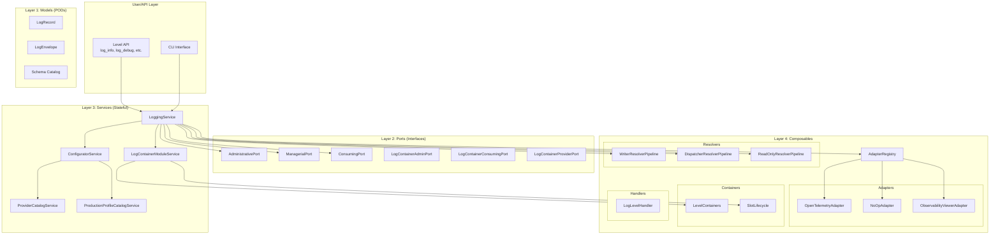

### High-Level Component Dependencies

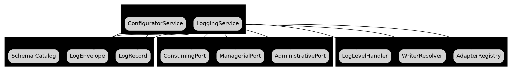

---

## Layer 1: Models (PODs - Data Transfer Objects)

Layer 1 contains pure data structures with no business logic. These are immutable by design and serve as the fundamental data carriers throughout the system.

### Core Components

| Component | File | Description |
|-----------|------|-------------|
| [`LogRecord`](03_DigitalTwin/logging_system/models/record.py:9) | `models/record.py` | Immutable log entry with record_id, payload, timestamps |
| [`LogEnvelope`](03_DigitalTwin/logging_system/models/envelope.py:14) | `models/envelope.py` | Generic envelope with content, context, metadata |
| [`utc_now_iso`](03_DigitalTwin/logging_system/models/utc_now_iso.py) | `models/utc_now_iso.py` | UTC timestamp utility |
| Schema Catalog | `models/default_content_schema_catalog.py` | Default schemas: DEFAULT, ERROR, AUDIT |

### LogRecord Structure

```python
@dataclass(frozen=True)
class LogRecord:
    record_id: str                           # Unique identifier
    payload: Mapping[str, Any]               # Log data
    created_at_utc: str                      # Creation timestamp
    dispatched_at_utc: str | None = None     # Dispatch timestamp
    adapter_key: str | None = None           # Target adapter
```

### LogEnvelope Generic Structure

```python
@dataclass(frozen=True)
class LogEnvelope(Generic[TContent, TContext, TMeta]):
    content: TContent    # The log message/data
    context: TContext    # Runtime context (level, tenant, etc.)
    metadata: TMeta      # Metadata (timestamps, IDs, etc.)
    created_at_utc: str  # Creation timestamp
```

### Schema Catalog Constants

```python
DEFAULT_CONTENT_SCHEMA_ID = "schema.logging.content.default"
ERROR_CONTENT_SCHEMA_ID   = "schema.logging.content.error"
AUDIT_CONTENT_SCHEMA_ID   = "schema.logging.content.audit"
```

### Layer 1 Class Diagram

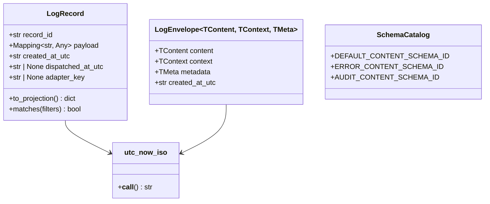

---

## Layer 2: Ports (Interfaces/Contracts)

Layer 2 defines the interface contracts using Python Protocols with `runtime_checkable`. These define the boundaries between layers and enable dependency injection.

### Core Port Interfaces

| Port | File | Purpose |
|------|------|---------|
| [`AdministrativePort`](03_DigitalTwin/logging_system/ports/administrative_port.py:7) | `ports/administrative_port.py` | Schema, policy, profile, catalog CRUD |
| [`ManagerialPort`](03_DigitalTwin/logging_system/ports/managerial_port.py:8) | `ports/managerial_port.py` | Binding, dispatch, configuration management |
| [`ConsumingPort`](03_DigitalTwin/logging_system/ports/consuming_port.py:8) | `ports/consuming_port.py` | Log submission, querying, subscriptions |
| [`LogContainerProviderPort`](03_DigitalTwin/logging_system/ports/log_container_provider_port.py:11) | `ports/log_container_provider_port.py` | Combined container interface |
| [`AdapterRegistryPort`](03_DigitalTwin/logging_system/ports/adapter_registry_port.py:9) | `ports/adapter_registry_port.py` | Adapter registration/resolution |
| [`ResourceManagementClientPort`](03_DigitalTwin/logging_system/ports/resource_management_client_port.py:8) | `ports/resource_management_client_port.py` | Lease management |

### Port Interface Hierarchy

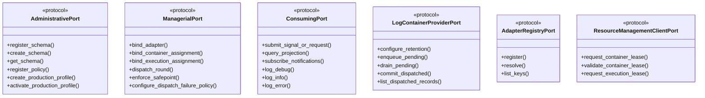

---

## Layer 3: Services (Stateful Business Logic)

Layer 3 contains the core stateful services that implement the port interfaces and contain business logic.

### Core Services

| Service | File | Implements |
|---------|------|------------|
| [`LoggingService`](03_DigitalTwin/logging_system/services/logging_service.py:73) | `services/logging_service.py` | AdministrativePort, ManagerialPort, ConsumingPort |
| [`ConfiguratorService`](03_DigitalTwin/logging_system/configurator/service.py:36) | `configurator/service.py` | Configuration management |
| [`ProviderCatalogService`](03_DigitalTwin/logging_system/provider_catalogs/service.py:11) | `provider_catalogs/service.py` | Provider/connection/persistence catalog |
| [`ProductionProfileCatalogService`](03_DigitalTwin/logging_system/production_profiles/service.py:12) | `production_profiles/service.py` | Production profile management |
| [`LogContainerModuleService`](03_DigitalTwin/logging_system/log_container_module/service.py:16) | `log_container_module/service.py` | Log storage and lifecycle |

### LoggingService Architecture

The [`LoggingService`](03_DigitalTwin/logging_system/services/logging_service.py:73) is the central orchestrator that:

1. **Manages State**: Records, pending queues, listeners, audit trail
2. **Implements Ports**: All AdministrativePort, ManagerialPort, ConsumingPort methods
3. **Coordinates Components**: Adapters, resolvers, containers, handlers
4. **Handles Thread Safety**: Uses `RLock` for thread-safe operations

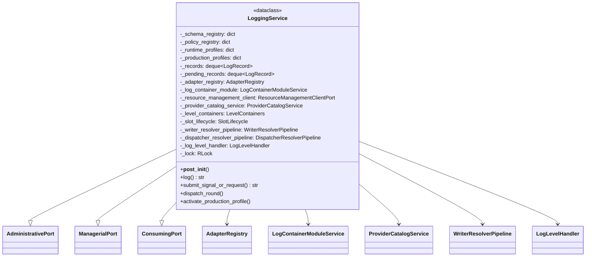

### Layer 3 Service Dependencies

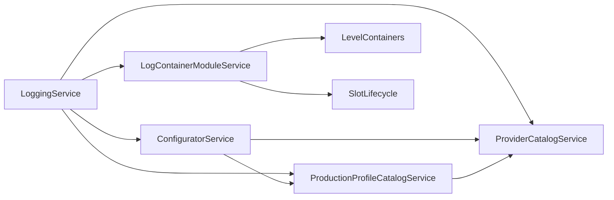

---

## Layer 4: Adapters, Handlers, Resolvers & Composables

Layer 4 contains the composable components that extend system capabilities.

### Adapters

| Adapter | File | Purpose |
|---------|------|---------|
| [`AdapterRegistry`](03_DigitalTwin/logging_system/adapters/adapter_registry.py:10) | `adapters/adapter_registry.py` | Central adapter registration and resolution |
| [`OpenTelemetryAdapter`](03_DigitalTwin/logging_system/adapters/open_telemetry_adapter.py:13) | `adapters/open_telemetry_adapter.py` | OpenTelemetry protocol emission |
| [`NoOpAdapter`](03_DigitalTwin/logging_system/adapters/no_op_adapter.py:10) | `adapters/no_op_adapter.py` | No-operation fallback adapter |
| [`ObservabilityViewerAdapter`](03_DigitalTwin/logging_system/adapters/observability_viewer_adapter.py) | `adapters/observability_viewer_adapter.py` | Observability viewer integration |
| [`FileStateStore`](03_DigitalTwin/logging_system/adapters/file_state_store.py) | `adapters/file_state_store.py` | File-based state persistence |

### Resolvers

| Resolver | File | Purpose |
|----------|------|---------|
| [`WriterResolverPipeline`](03_DigitalTwin/logging_system/resolvers/writer_resolver_pipeline.py:9) | `resolvers/writer_resolver_pipeline.py` | Resolves write targets by level/tenant |
| [`DispatcherResolverPipeline`](03_DigitalTwin/logging_system/resolvers/dispatcher_resolver_pipeline.py:9) | `resolvers/dispatcher_resolver_pipeline.py` | Resolves dispatch candidates and receivers |
| [`ReadOnlyResolverPipeline`](03_DigitalTwin/logging_system/resolvers/readonly_resolver_pipeline.py) | `resolvers/readonly_resolver_pipeline.py` | Read-only query resolution |

### Containers

| Container | File | Purpose |
|-----------|------|---------|
| [`LevelContainers`](03_DigitalTwin/logging_system/containers/level_containers.py:9) | `containers/level_containers.py` | Partitioned log storage by level/tenant |
| [`SlotLifecycle`](03_DigitalTwin/logging_system/containers/slot_lifecycle.py) | `containers/slot_lifecycle.py` | Slot state management |

### Handlers

| Handler | File | Purpose |
|---------|------|---------|
| [`LogLevelHandler`](03_DigitalTwin/logging_system/handlers/log_level_handler.py:11) | `handlers/log_level_handler.py` | Normalizes log levels and routes to containers |

### Level API

| Component | File | Purpose |
|-----------|------|---------|
| [`ELogLevel`](03_DigitalTwin/logging_system/level_api/e_log_level.py:6) | `level_api/e_log_level.py` | Enum: TRACE, DEBUG, INFO, WARN, ERROR, FATAL |
| [`LogInfo`](03_DigitalTwin/logging_system/level_api/log_info.py:11) | `level_api/log_info.py` | Level-specific submitter for INFO |
| LogDebug, LogWarn, LogError, LogFatal, LogTrace | `level_api/` | Level-specific submitters |

### Previewers

| Previewer | File | Purpose |
|-----------|------|---------|
| [`ConsolePreviewer`](03_DigitalTwin/logging_system/previewers/console_previewer.py) | `previewers/console_previewer.py` | Console output formatting |
| [`WebPreviewer`](03_DigitalTwin/logging_system/previewers/web_previewer.py) | `previewers/web_previewer.py` | Web/JSON output formatting |

### Layer 4 Component Interactions

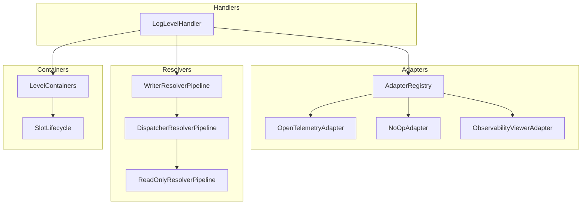

---

## Component Interaction Diagrams

### Log Submission Flow

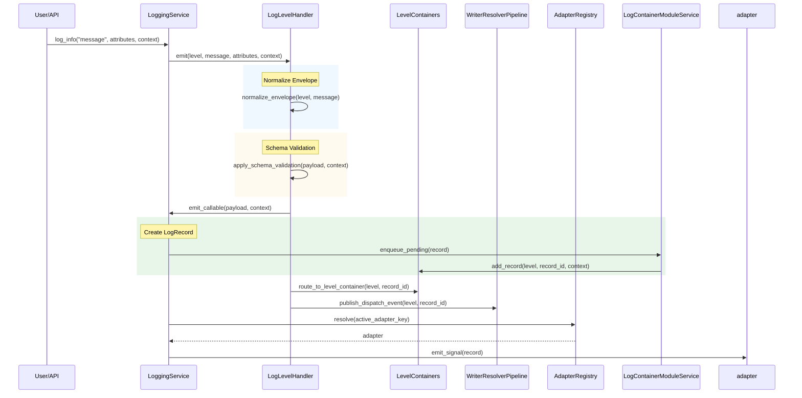

### Production Profile Activation Flow

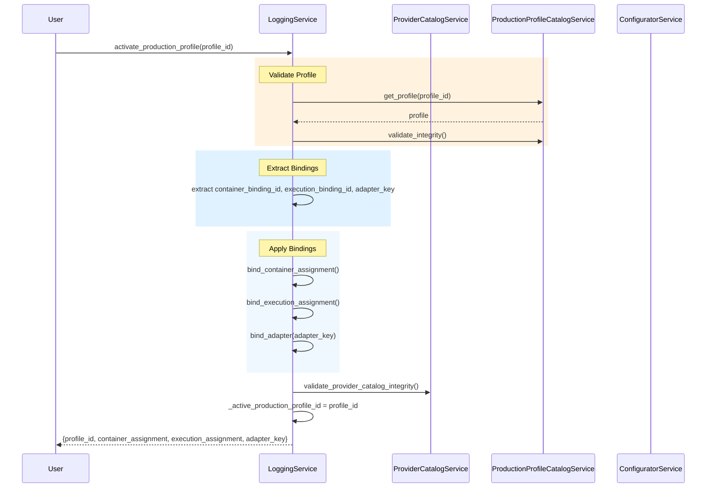

### Dispatch Round Flow

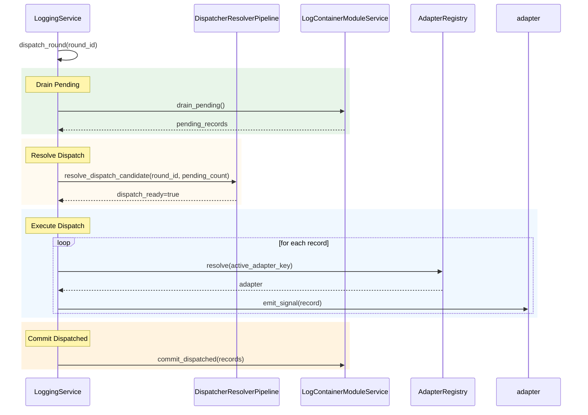

---

## Data Flow Architecture

### Input → Storage → Output Pipeline

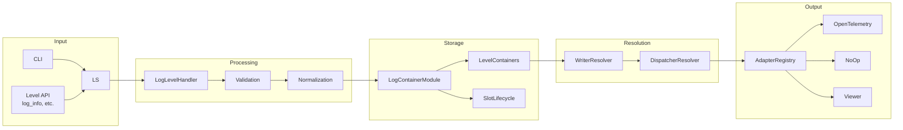

---

## CLI (Command Line Interface)

The CLI provides a comprehensive command-line interface for interacting with the LoggingService. It's built using argparse and provides subcommands for all major operations.

| Component | File | Description |
|-----------|------|-------------|
| [`run_cli`](03_DigitalTwin/logging_system/cli/run_cli.py:12) | `cli/run_cli.py` | Main CLI entry point, handles all commands |
| [`build_parser`](03_DigitalTwin/logging_system/cli/parser.py:12) | `cli/parser.py` | Argument parser with all subcommands |
| [`parse_json_object`](03_DigitalTwin/logging_system/cli/json_payload_parser.py:6) | `cli/json_payload_parser.py` | JSON payload parsing utility |

### CLI Commands Overview

```mermaid
graph TB
    subgraph "Status & Info"
        ST[status] --> LS
        LA[list-adapters] --> LS
        EV[evidence] --> LS
    end
    
    subgraph "Logging"
        EM[emit] --> LS
        LD[log-debug] --> LS
        LI[log-info] --> LS
        LW[log-warn] --> LS
        LE[log-error] --> LS
        LF[log-fatal] --> LS
        LT[log-trace] --> LS
    end
    
    subgraph "Binding"
        BA[bind-adapter] --> LS
        BCA[bind-container-assignment] --> LS
        BEA[bind-execution-assignment] --> LS
    end
    
    subgraph "Schema Management"
        SL[schema-list] --> LS
        SG[schema-get] --> LS
        SC[schema-create] --> LS
    end
    
    subgraph "Production Profiles"
        PPA[production-profile-activate] --> LS
    end
    
    subgraph "Configuration"
        CL[config-list] --> LS
        CG[config-get] --> LS
        CA[config-apply] --> LS
    end
    
    LS[LoggingService]
```

### CLI Command Categories

| Category | Commands |
|----------|----------|
| **Status** | `status`, `list-adapters`, `evidence` |
| **Logging** | `emit`, `log-debug`, `log-info`, `log-warn`, `log-error`, `log-fatal`, `log-trace` |
| **Binding** | `bind-adapter`, `bind-container-assignment`, `bind-execution-assignment`, `unbind-container-assignment`, `unbind-execution-assignment`, `container-assignment-status`, `execution-assignment-status` |
| **Dispatch** | `dispatch`, `safepoint` |
| **Schema** | `schema-list`, `schema-get`, `schema-create`, `schema-update`, `schema-delete` |
| **Policy** | `policy-list`, `policy-get`, `policy-create`, `policy-update`, `policy-delete` |
| **Runtime Profiles** | `profile-list`, `profile-get`, `profile-create`, `profile-update`, `profile-delete` |
| **Production Profiles** | `production-profile-list`, `production-profile-get`, `production-profile-create`, `production-profile-update`, `production-profile-delete`, `production-profile-activate` |
| **Unified Config** | `config-list`, `config-get`, `config-create`, `config-update`, `config-delete`, `config-apply` |
| **Policy Configuration** | `set-dispatch-failure-policy`, `set-signal-qos-profile`, `set-mandatory-label-schema`, `set-slot-lifecycle-policy`, `set-level-container-policy`, `set-resolver-pipeline-policy`, `set-previewer-profile`, `set-loglevel-api-policy` |
| **Preview** | `preview-console`, `preview-web` |

### CLI Usage Example

```bash
# Emit a log entry
python -m logging_system.cli emit --level INFO --message "Application started"

# List available adapters
python -m logging_system.cli list-adapters

# Query logs
python -m logging_system.cli query --filters-json '{"level": "ERROR"}'

# Activate production profile
python -m logging_system.cli production-profile-activate --profile-id prod.logging.local.default
```

---

## Specialization Module

The Specialization module provides integration with the ObservabilityViewerSystem for advanced log viewing capabilities.

| Component | File | Description |
|-----------|------|-------------|
| [`LoggingViewerSpecialization`](03_DigitalTwin/logging_system/specialization/logging_viewer_specialization.py:1) | `specialization/logging_viewer_specialization.py` | Viewer integration facade |

### Specialization Constants

```python
LOGGING_VIEWER_SCHEMA_ID = "logging.schema.v1"
LOGGING_VIEWER_CONSOLE_FORMAT_ID = "logging.console.default.v1"
LOGGING_VIEWER_WEB_FORMAT_ID = "logging.web.default.v1"
LOGGING_VIEWER_PROFILE_ID = "logging.default"
LOGGING_VIEWER_SPECIALIZATION_CONFIG_ID = "logging.specialization_profile.default"
```

### Specialization Functions

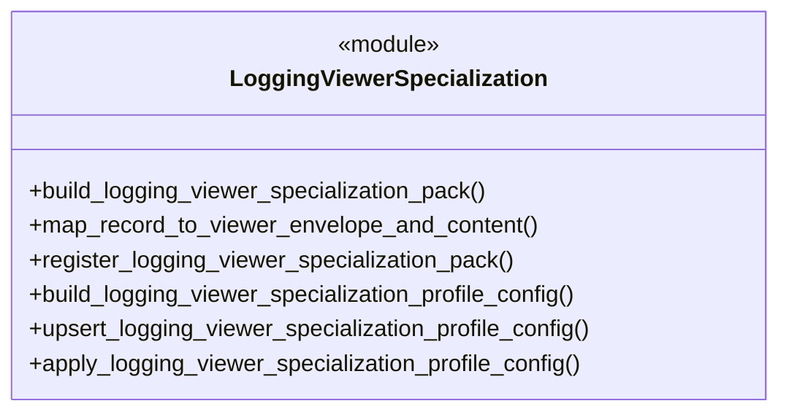

---

## Resource Management

The Resource Management module provides lease-based resource management for containers and execution contexts.

| Component | File | Description |
|-----------|------|-------------|
| [`InMemoryResourceManagementClient`](03_DigitalTwin/logging_system/resource_management/adapters/in_memory_resource_management_client.py) | `resource_management/adapters/in_memory_resource_management_client.py` | In-memory implementation |
| [`ThreadPoolResourceManagementClient`](03_DigitalTwin/logging_system/resource_management/adapters/thread_pool_resource_management_client.py) | `resource_management/adapters/thread_pool_resource_management_client.py` | Thread pool implementation |

### Resource Management Capabilities

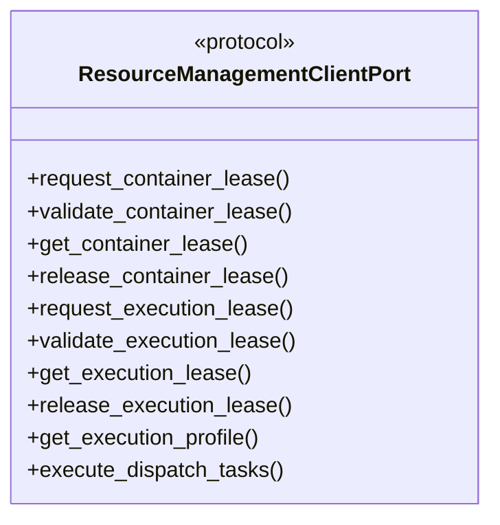

---

## System Capabilities Summary

### Configuration Management

| Capability | Description |
|------------|-------------|
| Schema Management | Create, read, update, delete log content schemas |
| Policy Management | Dispatch, retention, QoS policies |
| Production Profiles | Bundled configuration for production deployment |
| Provider Catalogs | Provider, connection, persistence catalog entries |

### Logging Operations

| Operation | Description |
|-----------|-------------|
| Submit Signal | Submit log with payload and context |
| Level-Based Logging | log_debug, log_info, log_warn, log_error, log_fatal, log_trace |
| Query Projection | Filter and paginate log records |
| Subscribe Notifications | Register listeners for log events |

### Container Management

| Feature | Description |
|---------|-------------|
| Level Partitioning | Organize logs by level (DEBUG, INFO, etc.) |
| Tenant Partitioning | Multi-tenant isolation by tenant ID |
| Hybrid Partitioning | Combined tenant + level partitioning |
| Slot Lifecycle | Track slot states through dispatch cycle |

### Dispatch & Resolution

| Feature | Description |
|---------|-------------|
| Writer Pipeline | Resolve write targets by level/tenant |
| Dispatcher Pipeline | Resolve dispatch candidates and receivers |
| Read-Only Pipeline | Query resolution for inspections |
| Handoff Events | Track record movement between pipelines |

### Adapter System

| Adapter | Key | Purpose |
|---------|-----|---------|
| OpenTelemetry | `telemetry.opentelemetry` | Standard OTel protocol emission |
| NoOp | `telemetry.noop` | Drop-all fallback |
| Observability Viewer | `viewer.observability` | Viewer integration |

### Thread Safety Modes

| Mode | Description |
|------|-------------|
| `single_writer_per_partition` | Default, optimized for single-writer per partition |
| `thread_safe_locked` | Full locking for multi-threaded access |
| `lock_free_cas` | Lock-free compare-and-swap operations |

### Backpressure Actions

| Action | Description |
|--------|-------------|
| `block` | Block when buffer full |
| `drop_oldest` | Drop oldest records |
| `drop_newest` | Drop newest records |
| `sample` | Sample percentage of logs |
| `retry_with_jitter` | Retry with random delay |

---

## File Reference Index

| Category | Files |
|----------|-------|
| **Models (Layer 1)** | `models/__init__.py`, `models/record.py`, `models/envelope.py`, `models/utc_now_iso.py`, `models/default_content_schema_catalog.py` |
| **Ports (Layer 2)** | `ports/administrative_port.py`, `ports/managerial_port.py`, `ports/consuming_port.py`, `ports/adapter_registry_port.py`, `ports/log_container_*.py`, `ports/resource_management_client_port.py` |
| **Services (Layer 3)** | `services/logging_service.py`, `configurator/service.py`, `provider_catalogs/service.py`, `production_profiles/service.py`, `log_container_module/service.py` |
| **Composables (Layer 4)** | `adapters/*.py`, `handlers/log_level_handler.py`, `resolvers/*.py`, `containers/*.py`, `level_api/*.py`, `previewers/*.py` |
| **CLI** | `cli/run_cli.py`, `cli/parser.py`, `cli/json_payload_parser.py` |
| **Specialization** | `specialization/logging_viewer_specialization.py` |
| **Resource Management** | `resource_management/adapters/*.py` |

---

*Document Version: 1.1*
*Generated: 2026-03-11*
*Architecture: Multi-Tier Object Architecture (PTOA)*
