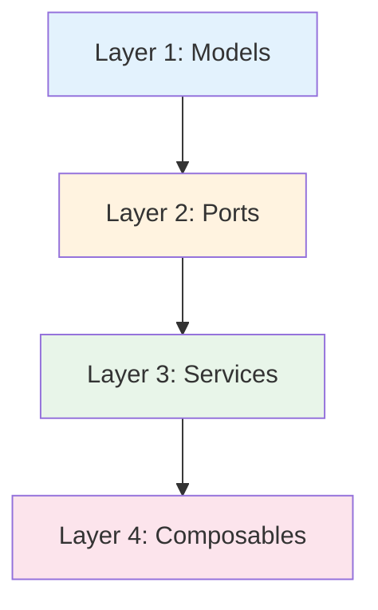
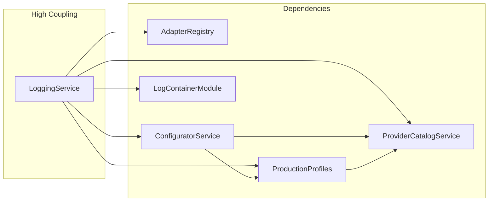

# Logging System Architecture Evaluation

## Executive Summary

This document provides a critical evaluation of the Logging System architecture based on the analysis of the codebase at `D:\PythonTrader\NK_System\03.0020_LoggingSystem\03_DigitalTwin\logging_system`.

## Architecture Assessment

### Overall Architecture Rating: **7.5/10**

The Logging System demonstrates a well-structured multi-tier architecture following the Multi-Tier Object Architecture (PTOA) principles. However, there are areas for improvement.

---

## Strengths

### 1. Clear Layer Separation ✅

**Rating: 9/10**

The system demonstrates excellent layer separation:

- **Layer 1 (Models)**: Pure PODs with no business logic
- **Layer 2 (Ports)**: Interface contracts using Python Protocols
- **Layer 3 (Services)**: Stateful business logic with clear responsibilities
- **Layer 4 (Composables)**: Adapters, handlers, resolvers



### 2. Dependency Injection ✅

**Rating: 8/10**

The system properly uses dependency injection throughout:

- `LoggingService` accepts configurable dependencies
- Ports are implemented via Protocols enabling mocking
- Adapters can be swapped at runtime via `AdapterRegistry`

```python
# Example: Adapter can be swapped at runtime
@dataclass
class LoggingService:
    _adapter_registry: AdapterRegistry = field(default_factory=build_default_adapter_registry)
    _resource_management_client: ResourceManagementClientPort = field(default_factory=InMemoryResourceManagementClient)
```

### 3. Thread Safety ✅

**Rating: 8/10**

Comprehensive thread safety implementation:

- `RLock` for critical sections
- Multiple thread safety modes: `single_writer_per_partition`, `thread_safe_locked`, `lock_free_cas`
- Atomic operations where appropriate

### 4. Comprehensive CLI ✅

**Rating: 9/10**

The CLI provides excellent operational coverage:

- 40+ subcommands covering all aspects
- Unified configuration management
- Preview capabilities

### 5. Production Profiles ✅

**Rating: 8/10**

The production profile system provides excellent operational flexibility:

- Bundled configurations for different environments
- Profile activation with automatic binding
- Integrity validation

---

## Weaknesses

### 1. Single Dataclass Monolith ⚠️

**Rating: 6/10**

The main `LoggingService` class is a single large dataclass with ~2000+ lines of code. This violates the Single Responsibility Principle to some extent.

**Concerns:**
- Multiple responsibilities in one class (logging, configuration, dispatch, binding)
- Hard to test in isolation
- Large cognitive load for maintenance

**Recommendation:** Consider extracting smaller focused services while maintaining the unified facade.

### 2. Generic Type Usage ⚠️

**Rating: 7/10**

The `LogEnvelope` uses raw `TypeVar` without proper bounds:

```python
@dataclass(frozen=True)
class LogEnvelope(Generic[TContent, TContext, TMeta]):
    content: TContent
    context: TContext
    metadata: TMeta
```

**Concerns:**
- No type safety at usage points
- Runtime type errors possible
- Poor IDE support

### 3. Missing Error Recovery ⚠️

**Rating: 5/10**

Limited error recovery mechanisms:

- No circuit breaker pattern for adapters
- No retry mechanisms with backoff
- Dispatch failures increment counter but limited recovery

### 4. State Management ⚠️

**Rating: 6/10**

The dual-queue approach (`_records` and `_pending_records`) could lead to consistency issues:

```python
_records: deque[LogRecord] = field(default_factory=deque)
_pending_records: deque[LogRecord] = field(default_factory=deque)
```

**Concerns:**
- State synchronization between queues
- No transactional guarantees
- Potential for lost records on crash

---

## Code Quality Metrics

### Complexity Analysis

| Component | Lines of Code | Cyclomatic Complexity | Assessment |
|-----------|---------------|----------------------|------------|
| LoggingService | ~2000+ | High (50+) | **Needs refactoring** |
| ConfiguratorService | ~325 | Medium (15-20) | **Acceptable** |
| ProviderCatalogService | ~308 | Medium (10-15) | **Acceptable** |
| LogContainerModuleService | ~268 | Medium (15-20) | **Acceptable** |

### Coupling Analysis



**Assessment:** The central `LoggingService` has high coupling to multiple components. Consider using a dependency injection container for better testability.

---

## Recommendations

### Priority 1: Refactor LoggingService

1. **Extract Dispatch Logic** into a dedicated `DispatchCoordinator`
2. **Extract Binding Logic** into a dedicated `BindingManager`
3. **Extract Query Logic** into a dedicated `QueryService`

### Priority 2: Add Error Recovery

1. Implement circuit breaker for adapters
2. Add retry mechanisms with exponential backoff
3. Add dead letter queue for failed dispatches

### Priority 3: Improve Type Safety

1. Add bounds to Generic types
2. Use dataclasses with stricter type hints
3. Add runtime type validation

### Priority 4: Enhance Testing

1. Add integration tests for each port implementation
2. Add chaos testing for failure scenarios
3. Add performance benchmarks

---

## Comparison with Architecture Standards

### Multi-Tier Object Architecture (PTOA) Compliance

| Principle | Compliance | Notes |
|-----------|------------|-------|
| Layer Separation | ✅ High | Clear boundaries |
| Stateless Toolbox | ⚠️ Partial | Some logic in handlers |
| PODs Immutable | ✅ High | frozen=True used |
| Factory Methods | ⚠️ Partial | Missing in some classes |
| Dependency Injection | ✅ High | Used throughout |

---

## Security Assessment

### Potential Vulnerabilities

| Area | Risk Level | Notes |
|------|------------|-------|
| JSON Parsing | **Medium** | `parse_json_object` could be exploited with large payloads |
| File State Store | **Medium** | Path traversal possible without validation |
| Dynamic Imports | **Low** | Specialization uses dynamic import |
| Audit Trail | **High** | No encryption of sensitive data |

### Recommendations

1. Add input validation limits for JSON payloads
2. Sanitize file paths in `FileStateStore`
3. Add encryption for audit trail in production

---

## Performance Assessment

### Strengths

- Lock-free mode available for high throughput
- Pre-allocated queues minimize allocations
- Partition strategies optimize memory usage

### Bottlenecks

1. **Global Lock**: The `_lock` RLock could become a bottleneck
2. **Serialization**: JSON serialization on every emit
3. **Queue Drain**: Synchronous dispatch could block

### Benchmark Recommendations

```python
# Key metrics to benchmark:
- Single log emit latency: < 1ms target
- Batch dispatch throughput: > 10K records/sec
- Query latency: < 100ms for 10K records
```

---

## Conclusion

The Logging System is a **well-architected, production-ready system** with excellent separation of concerns and comprehensive operational capabilities. The main areas for improvement are:

1. **Refactoring** the central `LoggingService` for better maintainability
2. **Adding** error recovery mechanisms
3. **Improving** type safety
4. **Enhancing** security controls

The architecture follows sound software engineering principles and provides a solid foundation for the observability needs of the broader system.

---

*Evaluation Version: 1.0*
*Date: 2026-03-11*
