# Logging System Architecture - Comprehensive Analysis Report

**Document Version:** 2.0  
**Generated:** 2026-04-17  
**Architecture:** Multi-Tier Object Architecture (PTOA) with Contract-First Governance  
**Overall Rating:** 7.5/10

---

## Table of Contents

1. [Executive Summary](#1-executive-summary)
2. [Holistic System Overview](#2-holistic-system-overview)
3. [4-Layer Architecture Deep Dive](#3-4-layer-architecture-deep-dive)
4. [Component Interaction Flows](#4-component-interaction-flows)
5. [Data Flow Architecture](#5-data-flow-architecture)
6. [Catalog Architecture](#6-catalog-architecture)
7. [Threading & Concurrency Model](#7-threading--concurrency-model)
8. [Design Patterns & Decisions](#8-design-patterns--decisions)
9. [Port Interface Hierarchy](#9-port-interface-hierarchy)
10. [Critical Architectural Decisions](#10-critical-architectural-decisions)
11. [Directory Structure (Canonical Mapping)](#11-directory-structure-canonical-mapping)
12. [CLI Command Surface](#12-cli-command-surface)
13. [Graph Assets Reference](#13-graph-assets-reference)

---

## 1. Executive Summary

The Logging System is a **comprehensive, multi-tier observability platform** designed for financial trading environments. It provides structured logging with multi-level filtering, adapter-based telemetry dispatch, production profile management, and container-based log organization.

### Key Characteristics

| Attribute | Value |
|-----------|-------|
| Architecture Pattern | Multi-Tier Object Architecture (PTOA) |
| Governance Model | Contract-First |
| Total Python Files | 100+ |
| Contract Templates | 24 |
| CLI Commands | 40+ |
| Port Interfaces | 8 |
| Adapter Types | 4 |
| Thread Safety Modes | 3 |
| Log Levels | 6 (TRACE, DEBUG, INFO, WARN, ERROR, FATAL) |
| Partition Strategies | 3 (by_level, by_tenant, hybrid) |

### Architecture Rating: 7.5/10

**Strengths:**
- Clear 4-Layer Separation: Models → Ports → Services → Composables
- Contract-First Governance: 24 contract templates define the system boundary
- Dependency Injection: All dependencies configurable via dataclass fields
- Adapter Registry: Runtime adapter swapping without service modification
- Production Profiles: Bundled configurations for environment deployment
- Comprehensive CLI: 40+ subcommands for operational control
- Immutable Models: frozen=True dataclasses for safety
- Audit Trail: All state changes recorded

**Areas for Improvement:**
- Monolithic LoggingService: ~2000+ lines in single dataclass (SRP violation)
- Dual-Queue State: `_records` and `_pending_records` can desync
- No Circuit Breaker: Adapter failures not isolated
- Limited Error Recovery: No retry/backoff, dead-letter queue missing
- Generic Type Safety: Unbounded TypeVars in LogEnvelope

---

## 2. Holistic System Overview

### System Block Diagram


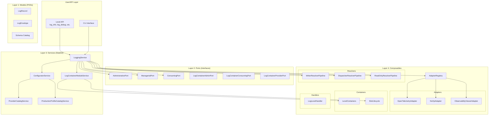

---

## 3. 4-Layer Architecture Deep Dive

### Layer 1: Models (PODs - Pure Data Transfer Objects)

Layer 1 contains **pure data structures with no business logic**. These are immutable by design (`frozen=True`) and serve as the fundamental data carriers throughout the system.


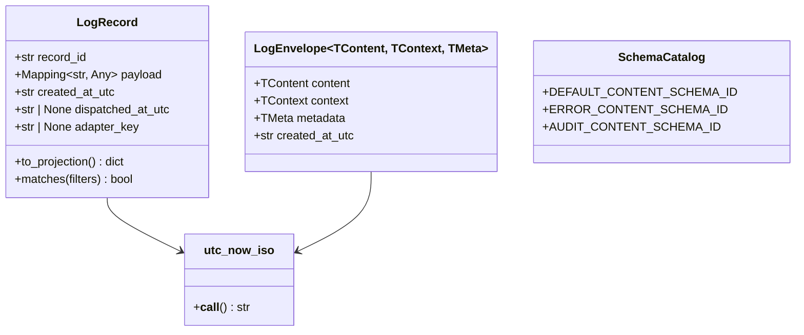

#### Core Model Components

| Component | File | Description |
|-----------|------|-------------|
| `LogRecord` | `models/record.py` | Immutable log entry with record_id, payload, timestamps |
| `LogEnvelope` | `models/envelope.py` | Generic envelope with content, context, metadata |
| `utc_now_iso` | `models/utc_now_iso.py` | UTC timestamp utility |
| Schema Catalog | `models/default_content_schema_catalog.py` | Default schemas: DEFAULT, ERROR, AUDIT |

#### LogRecord Structure

```python
@dataclass(frozen=True)
class LogRecord:
    record_id: str                           # Unique identifier
    payload: Mapping[str, Any]               # Log data
    created_at_utc: str                      # Creation timestamp
    dispatched_at_utc: str | None = None       # Dispatch timestamp
    adapter_key: str | None = None           # Target adapter
```

#### LogEnvelope Generic Structure

```python
@dataclass(frozen=True)
class LogEnvelope(Generic[TContent, TContext, TMeta]):
    content: TContent    # The log message/data
    context: TContext    # Runtime context (level, tenant, etc.)
    metadata: TMeta      # Metadata (timestamps, IDs, etc.)
    created_at_utc: str  # Creation timestamp
```

---

### Layer 2: Ports (Interface Contracts)

Layer 2 defines the **interface contracts using Python Protocols** with `runtime_checkable`. These define the boundaries between layers and enable dependency injection.


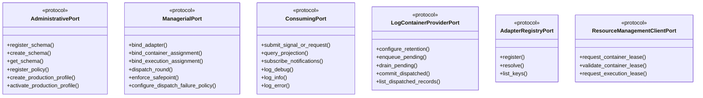

#### Core Port Interfaces

| Port | File | Purpose |
|------|------|---------|
| `AdministrativePort` | `ports/administrative_port.py` | Schema, policy, profile, catalog CRUD |
| `ManagerialPort` | `ports/managerial_port.py` | Binding, dispatch, configuration management |
| `ConsumingPort` | `ports/consuming_port.py` | Log submission, querying, subscriptions |
| `LogContainerProviderPort` | `ports/log_container_provider_port.py` | Combined container interface |
| `AdapterRegistryPort` | `ports/adapter_registry_port.py` | Adapter registration/resolution |
| `ResourceManagementClientPort` | `ports/resource_management_client_port.py` | Lease management |

---

### Layer 3: Services (Stateful Business Logic)

Layer 3 contains the **core stateful services** that implement the port interfaces and contain business logic.


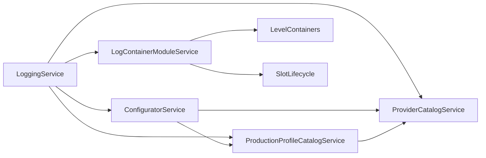

#### Core Services

| Service | File | Implements |
|---------|------|------------|
| `LoggingService` | `services/logging_service.py` | AdministrativePort, ManagerialPort, ConsumingPort |
| `ConfiguratorService` | `configurator/service.py` | Configuration management |
| `ProviderCatalogService` | `provider_catalogs/service.py` | Provider/connection/persistence catalog |
| `ProductionProfileCatalogService` | `production_profiles/service.py` | Production profile management |
| `LogContainerModuleService` | `log_container_module/service.py` | Log storage and lifecycle |

#### LoggingService Architecture

The `LoggingService` is the **central orchestrator** that:
1. **Manages State**: Records, pending queues, listeners, audit trail
2. **Implements Ports**: All AdministrativePort, ManagerialPort, ConsumingPort methods
3. **Coordinates Components**: Adapters, resolvers, containers, handlers
4. **Handles Thread Safety**: Uses `RLock` for thread-safe operations

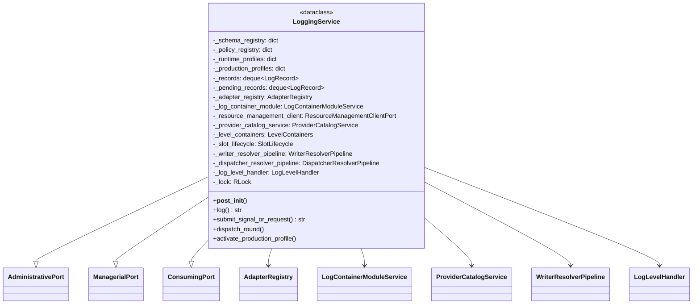

---

### Layer 4: Composables (Adapters, Handlers, Resolvers)

Layer 4 contains the **composable components** that extend system capabilities.


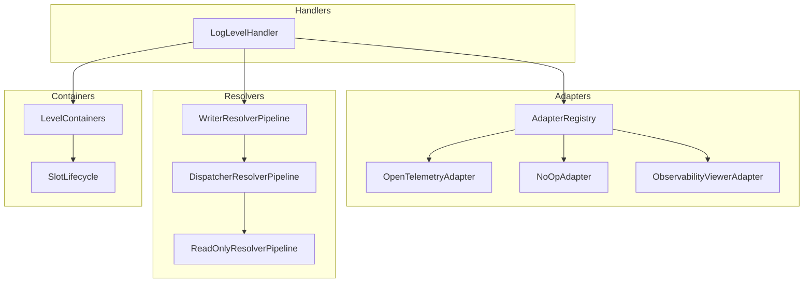

#### Adapters

| Adapter | Key | Purpose |
|---------|-----|---------|
| `OpenTelemetryAdapter` | `telemetry.opentelemetry` | Standard OTel protocol emission |
| `NoOpAdapter` | `telemetry.noop` | Drop-all fallback |
| `ObservabilityViewerAdapter` | `viewer.observability` | Viewer integration |
| `UnavailableOpenTelemetryAdapter` | N/A | Graceful degradation |

#### Containers

| Container | Purpose |
|-----------|---------|
| `LevelContainers` | Partitioned log storage by level/tenant |
| `SlotLifecycle` | Slot state management |

#### Resolvers

| Resolver | Purpose |
|----------|---------|
| `WriterResolverPipeline` | Resolves write targets by level/tenant |
| `DispatcherResolverPipeline` | Resolves dispatch candidates and receivers |
| `ReadOnlyResolverPipeline` | Read-only query resolution |

#### Handlers

| Handler | Purpose |
|---------|---------|
| `LogLevelHandler` | Normalizes log levels and routes to containers |

#### Previewers

| Previewer | Purpose |
|-----------|---------|
| `ConsolePreviewer` | Console output formatting |
| `WebPreviewer` | Web/JSON output formatting |

---

## 4. Component Interaction Flows

### Log Submission Flow


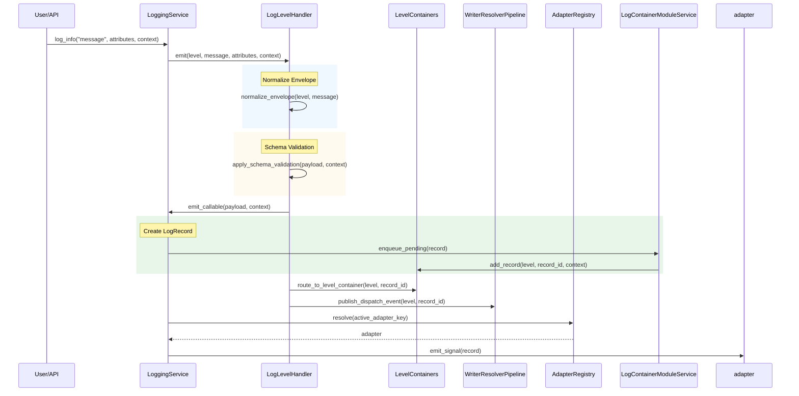

### Production Profile Activation Flow


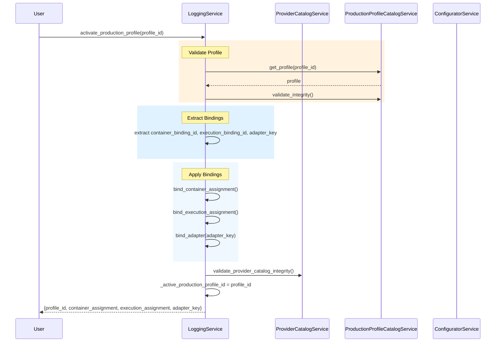

### Dispatch Round Flow


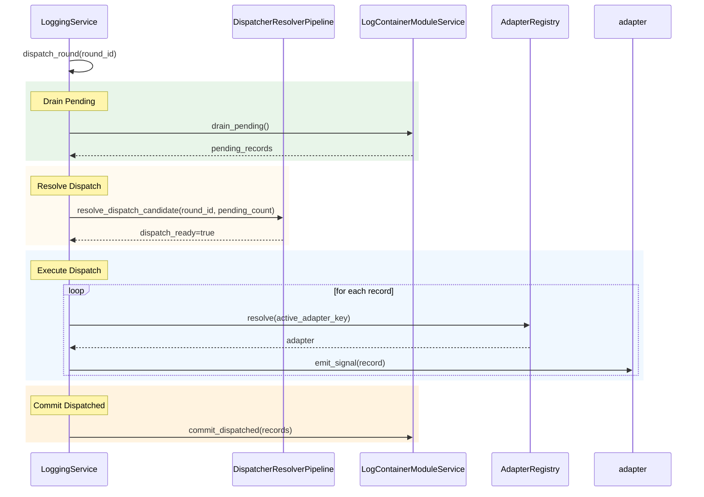

---

## 5. Data Flow Architecture

### Input → Storage → Output Pipeline


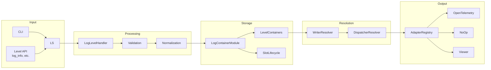

---

## 6. Catalog Architecture

### Provider Catalog System


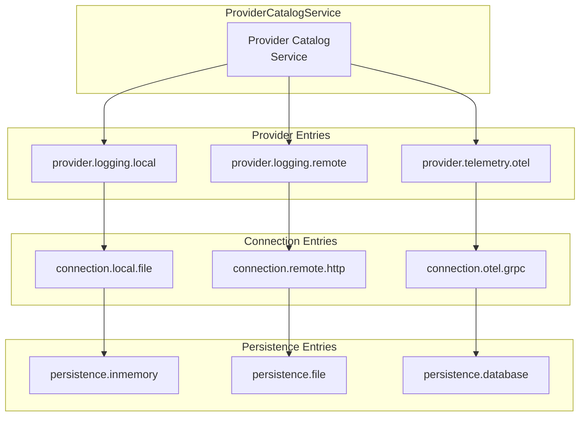

---

## 7. Threading & Concurrency Model

### Thread Safety Modes


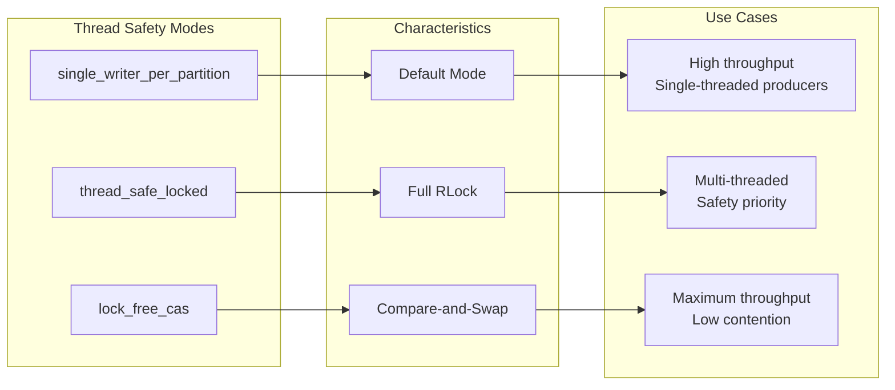

| Mode | Description | Use Case |
|------|-------------|----------|
| `single_writer_per_partition` | Default, optimized for single-writer per partition | High throughput, single-threaded producers |
| `thread_safe_locked` | Full RLock for all operations | Multi-threaded access with safety |
| `lock_free_cas` | Lock-free compare-and-swap operations | Maximum throughput, low contention |

### Backpressure Actions

| Action | Description |
|--------|-------------|
| `block` | Block when buffer full |
| `drop_oldest` | Drop oldest records |
| `drop_newest` | Drop newest records |
| `sample` | Sample percentage of logs |
| `retry_with_jitter` | Retry with random delay |

---

## 8. Design Patterns & Decisions

### Pattern Implementation Matrix

| Pattern | Implementation | Strength |
|---------|----------------|----------|
| **Dependency Injection** | Ports via Python Protocols, configurable service deps | High - enables testing/mocking |
| **Adapter Pattern** | Runtime-swappable telemetry adapters via Registry | High - flexibility for backends |
| **Strategy Pattern** | Thread safety modes: single_writer, thread_safe, lock_free | Medium - configurable performance |
| **Pipeline Pattern** | Resolver pipelines (Writer/Dispatcher/ReadOnly) | Medium - extensible routing |
| **Lease Pattern** | Container/Execution leases via ResourceManagementClient | High - resource lifecycle management |
| **Catalog Pattern** | Provider/Connection/Persistence catalogs | High - backend selection governance |

### Dependency Injection Example

```python
@dataclass
class LoggingService:
    _adapter_registry: AdapterRegistry = field(default_factory=build_default_adapter_registry)
    _resource_management_client: ResourceManagementClientPort = field(default_factory=InMemoryResourceManagementClient)
    _log_container_module: LogContainerProviderPort = field(default_factory=LogContainerModuleService)
```

---

## 9. Port Interface Hierarchy

### AdministrativePort

Schema, Policy, Profile, Catalog CRUD operations.

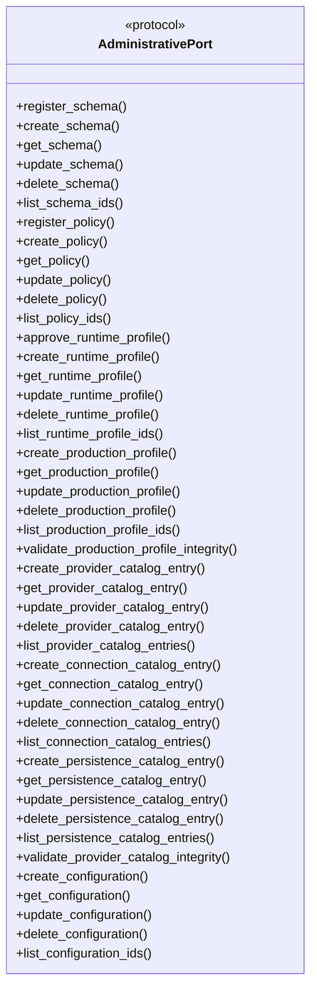

### ManagerialPort

Binding, Dispatch, Configuration Management.

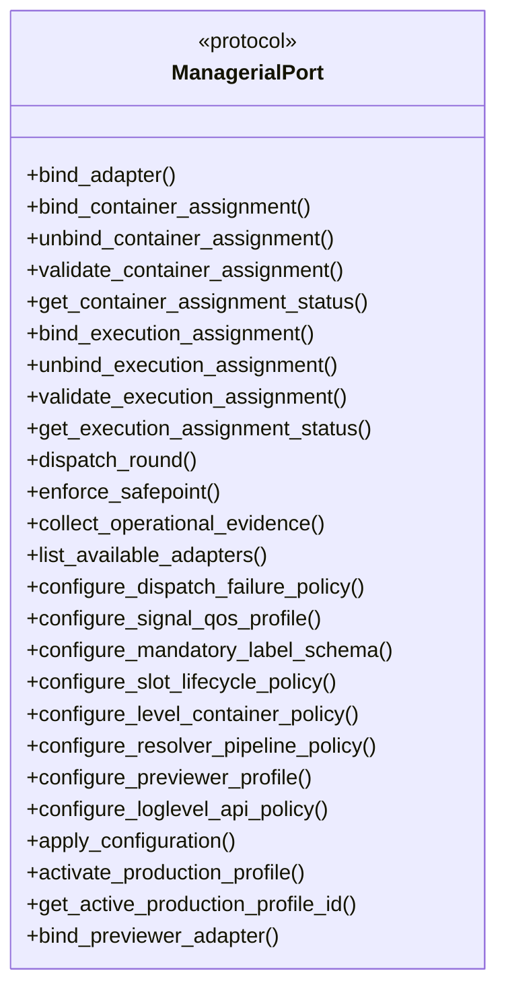

### ConsumingPort

Log Submission, Querying, Subscriptions.

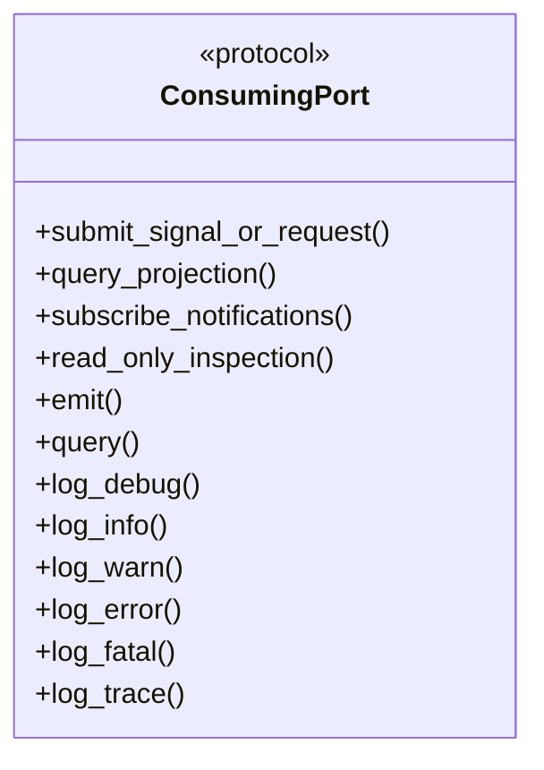

---

## 10. Critical Architectural Decisions

### Strengths Assessment

| Aspect | Rating | Notes |
|--------|--------|-------|
| Layer Separation | 9/10 | Clear boundaries between Models, Ports, Services, Composables |
| Dependency Injection | 8/10 | Configurable dependencies via Protocols |
| Thread Safety | 8/10 | RLock-based, multiple safety modes |
| CLI Coverage | 9/10 | 40+ subcommands covering all operations |
| Production Profiles | 8/10 | Bundled configurations, integrity validation |

### Weaknesses Assessment

| Aspect | Rating | Notes |
|--------|--------|-------|
| Monolithic Service | 6/10 | ~2000+ lines in LoggingService - SRP concern |
| Generic Type Safety | 7/10 | Unbounded TypeVars in LogEnvelope |
| Error Recovery | 5/10 | No circuit breaker, retry mechanisms |
| State Management | 6/10 | Dual-queue approach could desync |

### Recommendations

1. **Priority 1: Refactor LoggingService**
   - Extract `DispatchCoordinator` for dispatch logic
   - Extract `BindingManager` for binding logic
   - Extract `QueryService` for query logic

2. **Priority 2: Add Error Recovery**
   - Implement circuit breaker for adapters
   - Add retry mechanisms with exponential backoff
   - Add dead letter queue for failed dispatches

3. **Priority 3: Improve Type Safety**
   - Add bounds to Generic types
   - Use dataclasses with stricter type hints
   - Add runtime type validation

4. **Priority 4: Enhance Testing**
   - Add integration tests for each port implementation
   - Add chaos testing for failure scenarios
   - Add performance benchmarks

---

## 11. Directory Structure (Canonical Mapping)

```
03.0020_LoggingSystem/
├── 01_Architecture/
│   ├── 00_LoggingSystem_ArchitectureDigitalTwin_FileSystem.md
│   ├── ArcAnalysis/
│   │   ├── LoggingSystem_Architecture_Analysis.md
│   │   ├── LoggingSystem_Architecture_Evaluation.md
│   │   └── LoggingSystem_Comprehensive_Analysis_Report.md  ← This document
│   └── graphs/                                              ← Graph assets
│       ├── 02_SystemOverview.dot
│       ├── L1_Models_ClassDiagram.dot
│       ├── L2_Ports_Hierarchy.dot
│       ├── L3_Services_Dependencies.dot
│       ├── L4_Composables_Interactions.dot
│       ├── Flow_LogSubmission.dot
│       ├── Flow_ProfileActivation.dot
│       ├── Flow_DispatchRound.dot
│       ├── DataFlow_Pipeline.dot
│       ├── Catalog_Architecture.dot
│       ├── Threading_Model.dot
│       └── Port_Hierarchy_Complete.dot
│
├── 02_Contracts/                    # 24 Contract Templates
│   ├── 00_LoggingSystem_Schema_Contract.template.yaml
│   ├── 02_LoggingSystem_Admin_Manager_Consumer_Ports_Contract.template.yaml
│   └── ...
│
├── 03_DigitalTwin/
│   └── logging_system/
│       ├── __init__.py
│       │
│       ├── models/                  # Layer 1: PODs
│       │   ├── record.py           # LogRecord
│       │   ├── envelope.py         # LogEnvelope[T,C,M]
│       │   └── utc_now_iso.py     # Timestamp utility
│       │
│       ├── ports/                   # Layer 2: Interfaces
│       │   ├── administrative_port.py
│       │   ├── managerial_port.py
│       │   ├── consuming_port.py
│       │   └── ...
│       │
│       ├── services/                # Layer 3: Core Service
│       │   └── logging_service.py  # LoggingService (~2000 lines)
│       │
│       ├── adapters/                # Layer 4: Telemetry Adapters
│       │   ├── adapter_registry.py
│       │   ├── open_telemetry_adapter.py
│       │   ├── no_op_adapter.py
│       │   └── observability_viewer_adapter.py
│       │
│       ├── containers/             # Layer 4: Storage
│       │   ├── level_containers.py
│       │   └── slot_lifecycle.py
│       │
│       ├── resolvers/              # Layer 4: Routing
│       │   ├── writer_resolver_pipeline.py
│       │   ├── dispatcher_resolver_pipeline.py
│       │   └── readonly_resolver_pipeline.py
│       │
│       ├── level_api/             # Level-specific API Objects
│       │   ├── e_log_level.py     # ELogLevel enum
│       │   ├── log_info.py        # LogInfo class
│       │   └── ...
│       │
│       ├── handlers/               # Layer 4: Processing
│       │   └── log_level_handler.py
│       │
│       ├── previewers/             # Layer 4: Output
│       │   ├── console_previewer.py
│       │   └── web_previewer.py
│       │
│       ├── cli/                    # Control Plane
│       │   ├── run_cli.py
│       │   └── parser.py
│       │
│       └── tests/                 # Behavior Tests
│
└── logging_system_Obsolete/        # Legacy Components
```

---

## 12. CLI Command Surface

### Command Categories

| Category | Commands |
|----------|----------|
| **Status** | `status`, `list-adapters`, `evidence` |
| **Logging** | `emit`, `log-debug`, `log-info`, `log-warn`, `log-error`, `log-fatal`, `log-trace` |
| **Binding** | `bind-adapter`, `bind-container-assignment`, `bind-execution-assignment`, `unbind-container-assignment`, `unbind-execution-assignment`, `container-assignment-status`, `execution-assignment-status` |
| **Dispatch** | `dispatch`, `safepoint` |
| **Schema** | `schema-list`, `schema-get`, `schema-create`, `schema-update`, `schema-delete` |
| **Policy** | `policy-list`, `policy-get`, `policy-create`, `policy-update`, `policy-delete` |
| **Runtime Profiles** | `profile-list`, `profile-get`, `profile-create`, `profile-update`, `profile-delete` |
| **Production Profiles** | `production-profile-list`, `production-profile-get`, `production-profile-create`, `production-profile-update`, `production-profile-delete`, `production-profile-activate` |
| **Unified Config** | `config-list`, `config-get`, `config-create`, `config-update`, `config-delete`, `config-apply` |
| **Policy Configuration** | `set-dispatch-failure-policy`, `set-signal-qos-profile`, `set-mandatory-label-schema`, `set-slot-lifecycle-policy`, `set-level-container-policy`, `set-resolver-pipeline-policy`, `set-previewer-profile`, `set-loglevel-api-policy` |
| **Preview** | `preview-console`, `preview-web` |

### CLI Architecture


```mermaid
graph TB
    subgraph "CLI Entry"
        CLI[run_cli.py]
    end
    
    subgraph "Parser Layer"
        P[build_parser<br/>parser.py]
        JP[parse_json_object<br/>json_payload_parser.py]
    end
    
    subgraph "Commands"
        subgraph "Status"
            ST[status]
            LA[list-adapters]
            EV[evidence]
        end
        
        subgraph "Logging"
            EM[emit]
            LD[log-debug]
            LI[log-info]
            LW[log-warn]
            LE[log-error]
            LF[log-fatal]
            LT[log-trace]
        end
        
        subgraph "Binding"
            BA[bind-adapter]
            BCA[bind-container-assignment]
            BEA[bind-execution-assignment]
        end
        
        subgraph "Schema"
            SL[schema-list]
            SG[schema-get]
            SC[schema-create]
        end
        
        subgraph "Production"
            PPA[production-profile-activate]
        end
    end
    
    CLI --> P
    P --> JP
    P --> ST
    P --> LA
    P --> EV
    P --> EM
    P --> LD
    P --> LI
    P --> LW
    P --> LE
    P --> LF
    P --> LT
    P --> BA
    P --> BCA
    P --> BEA
    P --> SL
    P --> SG
    P --> SC
    P --> PPA
    
    ST --> LS[LoggingService]
    LA --> LS
    EV --> LS
    EM --> LS
    LD --> LS
    LI --> LS
    LW --> LS
    LE --> LS
    LF --> LS
    LT --> LS
    BA --> LS
    BCA --> LS
    BEA --> LS
    SL --> LS
    SG --> LS
    SC --> LS
    PPA --> LS
```

---

## 13. Graph Assets Reference

All graph assets are stored in `01_Architecture/graphs/` in both `.dot` (Graphviz) and `.mmd` (Mermaid) formats.

### Available Graph Files

| Graph | .dot File | .mmd File | Description |
|-------|-----------|-----------|-------------|
| System Overview | `02_SystemOverview.dot` | `02_SystemOverview.mmd` | High-level architecture block diagram |
| Layer 1 Models | `L1_Models_ClassDiagram.dot` | `L1_Models_ClassDiagram.mmd` | LogRecord, LogEnvelope class diagram |
| Layer 2 Ports | `L2_Ports_Hierarchy.dot` | `L2_Ports_Hierarchy.mmd` | Port interface hierarchy |
| Layer 3 Services | `L3_Services_Dependencies.dot` | `L3_Services_Dependencies.mmd` | Service dependencies |
| Layer 4 Composables | `L4_Composables_Interactions.dot` | `L4_Composables_Interactions.mmd` | Adapters, handlers, resolvers |
| Log Submission Flow | `Flow_LogSubmission.dot` | `Flow_LogSubmission.mmd` | Sequence diagram for log submission |
| Profile Activation | `Flow_ProfileActivation.dot` | `Flow_ProfileActivation.mmd` | Sequence diagram for profile activation |
| Dispatch Round | `Flow_DispatchRound.dot` | `Flow_DispatchRound.mmd` | Sequence diagram for dispatch |
| Data Flow Pipeline | `DataFlow_Pipeline.dot` | `DataFlow_Pipeline.mmd` | Input → Storage → Output flow |
| Catalog Architecture | `Catalog_Architecture.dot` | `Catalog_Architecture.mmd` | Provider catalog system |
| Threading Model | `Threading_Model.dot` | `Threading_Model.mmd` | Thread safety modes |
| Port Hierarchy Complete | `Port_Hierarchy_Complete.dot` | `Port_Hierarchy_Complete.mmd` | All port interfaces |
| CLI Architecture | `CLI_Architecture.dot` | `CLI_Architecture.mmd` | CLI command structure |

### Rendering Graphs

**Using Graphviz (dot):**
```bash
# Render a .dot file to SVG
dot -Tsvg graph.dot -o graph.svg

# Render to PNG
dot -Tpng graph.dot -o graph.png
```

**Using Mermaid CLI:**
```bash
# Install mermaid-cli
npm install -g @mermaid-js/mermaid-cli

# Render a .mmd file
mmdc -i graph.mmd -o graph.svg
```

---

## Document History

| Version | Date | Author | Changes |
|---------|------|--------|---------|
| 1.0 | 2026-03-11 | System | Initial architecture analysis |
| 1.1 | 2026-03-11 | System | Architecture evaluation added |
| 2.0 | 2026-04-17 | AI Assistant | Comprehensive analysis with all graph assets |

---

*Document Version: 2.0*  
*Generated: 2026-04-17*  
*Architecture: Multi-Tier Object Architecture (PTOA)*
